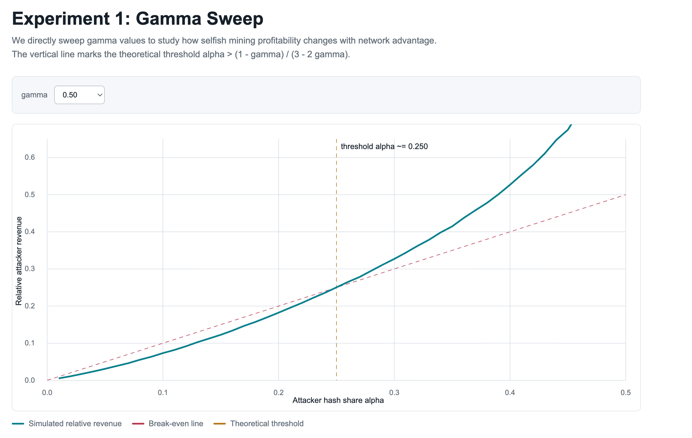
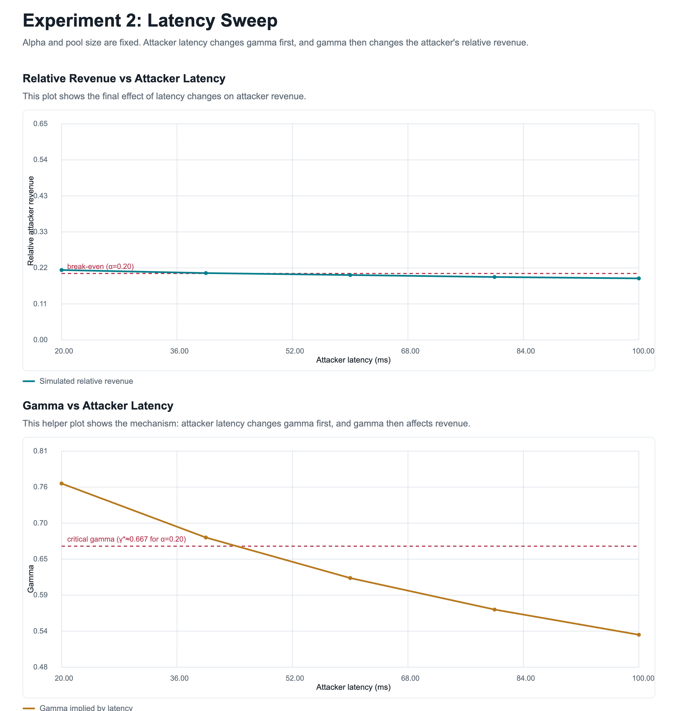
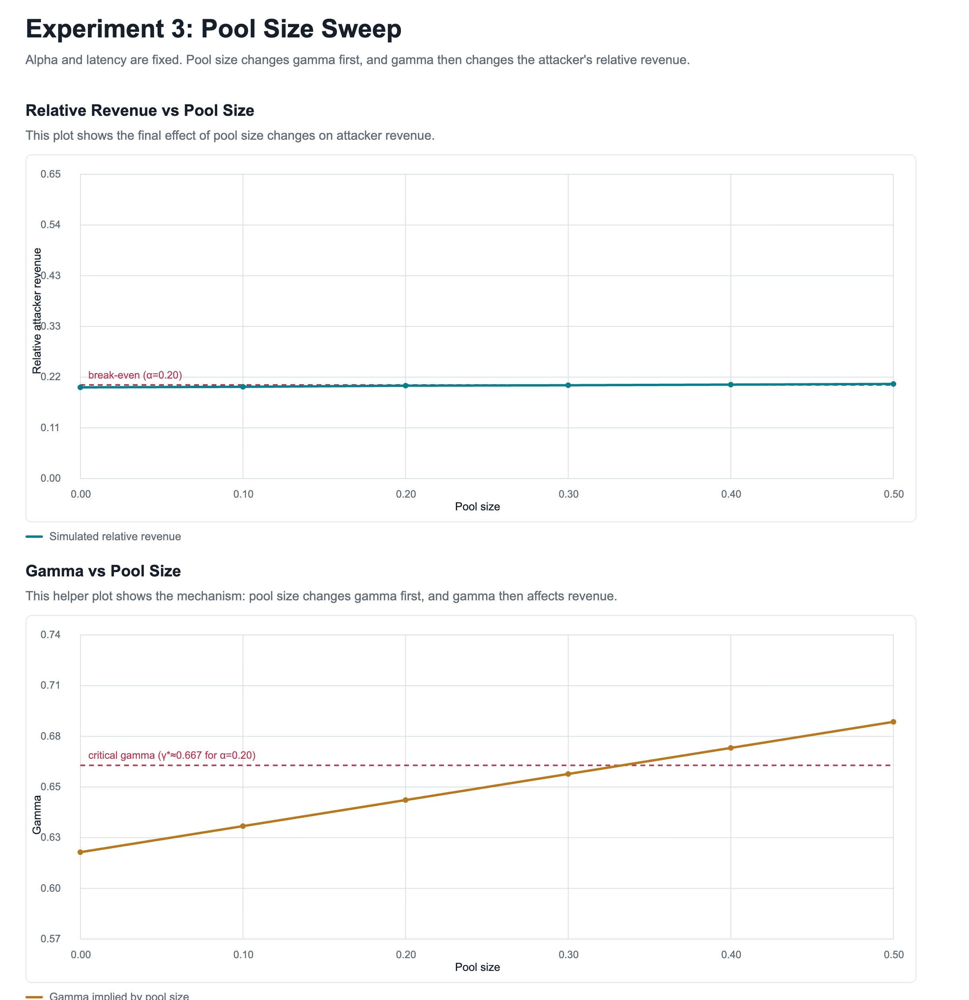

# Topic 6: Bitcoin Mining and Selfish Mining

This project contains a simulator for Bitcoin selfish mining. It models:

- attacker hash-rate share (alpha)
- honest network tie-breaking behavior (gamma)
- latency-derived propagation advantage
- pool-size effects

The simulator produces both **CSV data** and **HTML visualizations**.

---

## Mining Economics Background

Bitcoin miners earn expected revenue roughly proportional to their share of the global hash rate. Difficulty adjusts every 2016 blocks so that the network returns toward a 10 minute block interval after hash rate changes.

Mining pools reduce payout variance by sharing rewards:

- **PPS**: pays a fixed amount per submitted share, shifting variance risk to the pool operator.
- **PPLNS**: pays according to recent submitted shares around an actual block, keeping more variance on miners and discouraging pool hopping.

Energy consumption matters because mining profit is driven by block rewards and fees minus electricity, hardware, cooling, and operational costs. Strategies that increase relative revenue can be economically meaningful even if they do not increase total network block production.

---

---

# How to Use the Simulator

## Basic Usage

Run the simulator using:

    python selfish_mining_sim.py --experiment <type> [options]

### Available Experiments

- `legacy`   → Experiment 1 (gamma sweep)
- `latency`  → Experiment 2 (latency sweep)
- `pool`     → Experiment 3 (pool size sweep)

---

## Common Parameters

- `--alpha` → attacker hash-rate share  
- `--blocks` → number of mining events per trial  
- `--trials` → number of Monte Carlo runs  
- `--csv` → output CSV file  
- `--html` → output HTML visualization  

---

# Experiment 1: Gamma Sweep

This experiment studies how selfish mining profitability depends directly on **gamma**.

## Run

    python selfish_mining_sim.py --experiment legacy \
      --csv results/exp1_legacy.csv \
      --html results/exp1_legacy.html

## Output

- CSV: `results/exp1_legacy.csv`
- HTML: `results/exp1_legacy.html`

## Visualization

- X-axis: attacker hash share (alpha)
- Y-axis: relative attacker revenue

Includes:
- simulated revenue curve
- break-even line (y = alpha)
- theoretical threshold (vertical line)

---

# Experiment 2: Latency Sweep

This experiment studies how **network latency affects selfish mining**.

Latency first changes gamma, and gamma then affects the attacker's revenue.

## Run

    python selfish_mining_sim.py --experiment latency \
      --alpha 0.20 \
      --honest-latency-ms 100 \
      --pool-size 0.2 \
      --latency-values 20,40,60,80,100 \
      --csv results/exp2_latency.csv \
      --html results/exp2_latency.html

## Output

- CSV: `results/exp2_latency.csv`
- HTML: `results/exp2_latency.html`

## Visualization

### Chart 1
- latency → relative revenue
- includes break-even line (y = alpha)

### Chart 2
- latency → gamma
- includes critical gamma threshold

The critical gamma threshold indicates the minimum gamma required for selfish mining to be profitable at the given alpha.

---

# Experiment 3: Pool Size Sweep

This experiment studies how **mining pool size affects selfish mining**.

Pool size first changes gamma, and gamma then affects the attacker's revenue.

## Run

    python selfish_mining_sim.py --experiment pool \
      --alpha 0.20 \
      --attacker-latency-ms 50 \
      --honest-latency-ms 100 \
      --pool-values 0.0,0.1,0.2,0.3,0.4,0.5 \
      --csv results/exp3_pool.csv \
      --html results/exp3_pool.html

## Output

- CSV: `results/exp3_pool.csv`
- HTML: `results/exp3_pool.html`

## Visualization

### Chart 1
- pool size → relative revenue
- includes break-even line (y = alpha)

### Chart 2
- pool size → gamma
- includes critical gamma threshold

---
# Result

## Experiment 1: Gamma Sweep

## Experiment 2: Latency Sweep

## Experiment 3: Pool Size Sweep

---

# Selfish Mining Model

Eyal and Sirer showed that a miner can gain advantage by:

- withholding blocks
- selectively releasing them
- causing honest miners to waste work on orphaned blocks

---

## Parameters

- **alpha**: attacker hash-rate share  
- **gamma**: fraction of honest miners mining on attacker’s chain during a tie  
- **network latency**: used to estimate gamma  
- **pool size**: propagation advantage  

---

## Theoretical Threshold

Selfish mining becomes profitable when:

    alpha > (1 - gamma) / (3 - 2 * gamma)

---

## Examples

- gamma = 0.00 → threshold ≈ 0.333  
- gamma = 0.50 → threshold ≈ 0.250  
- gamma = 1.00 → threshold ≈ 0.000  

---

# Key Insight

- Experiment 1 identifies profitability thresholds
- Experiment 2 shows how latency influences gamma and revenue
- Experiment 3 shows how pool size influences gamma and revenue

Together, they demonstrate how **network advantage can lead to centralization incentives in Bitcoin mining**.
